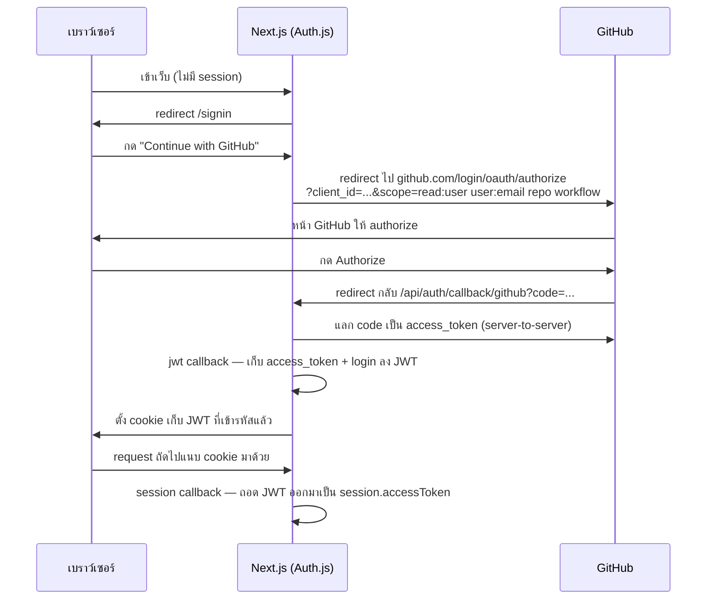
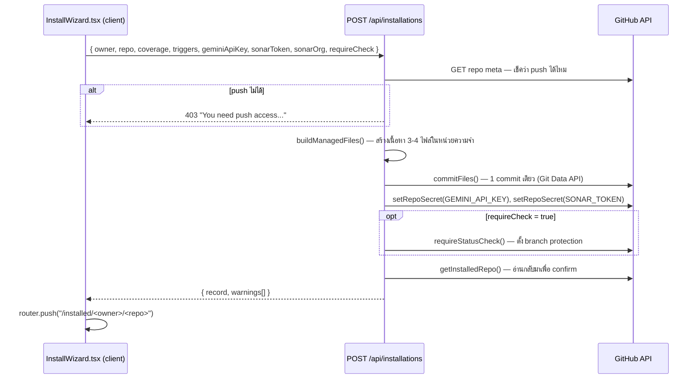
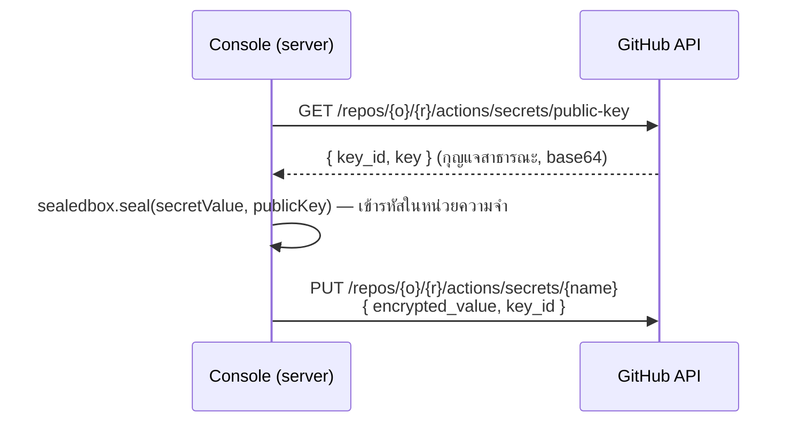
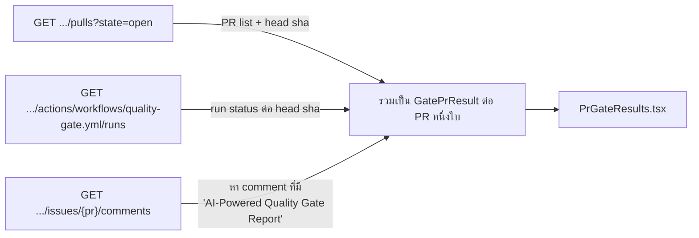
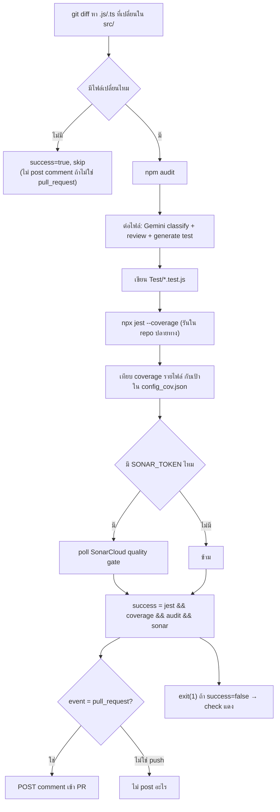

# Handbook — Quality Gate Console

คู่มือเทคนิคของโปรเจกต์นี้ อธิบายว่า **ใช้อะไรสร้าง**, **ทำงานยังไง**, และ **ทำไมถึงออกแบบแบบนี้** — เขียนแยกจาก [README.md](README.md) ซึ่งเป็นคู่มือ "ใช้งานยังไง" (setup + user flow) ส่วนไฟล์นี้คือ "ทำไมโค้ดถึงเป็นแบบนี้" สำหรับคนที่จะอ่าน/แก้โค้ดต่อ

> อ้างอิงพร้อมเลขบรรทัด เช่น `src/lib/auth.ts:49` — ไฟล์เปลี่ยนได้ตลอดเวลา เลขบรรทัดอาจขยับ ให้ดูชื่อฟังก์ชัน/ชื่อไฟล์เป็นหลัก

---

## สารบัญ

1. [ระบบนี้คืออะไร](#1-ระบบนี้คืออะไร)
2. [เทคโนโลยีที่ใช้ และทำไม](#2-เทคโนโลยีที่ใช้-และทำไม)
3. [สถาปัตยกรรมโดยรวม](#3-สถาปัตยกรรมโดยรวม)
4. [Authentication — GitHub OAuth ทำงานยังไง](#4-authentication--github-oauth-ทำงานยังไง)
5. [ไม่มีฐานข้อมูล — ปรัชญา stateless](#5-ไม่มีฐานข้อมูล--ปรัชญา-stateless)
6. [Flow ที่ 1: ติดตั้ง gate ลง repo](#6-flow-ที่-1-ติดตั้ง-gate-ลง-repo)
7. [การเข้ารหัส secret แบบ sealed box](#7-การเข้ารหัส-secret-แบบ-sealed-box)
8. [ไฟล์ workflow ที่สร้างให้ — ทำไมแต่ละบรรทัดถึงอยู่ตรงนั้น](#8-ไฟล์-workflow-ที่สร้างให้--ทำไมแต่ละบรรทัดถึงอยู่ตรงนั้น)
9. [Flow ที่ 2: อ่านผลกลับมาแสดง](#9-flow-ที่-2-อ่านผลกลับมาแสดง)
10. [Flow ที่ 3: แก้ค่า / จัดการ secret / branch protection / เคลียร์ประวัติ / ถอนการติดตั้ง](#10-flow-ที่-3-แก้ค่า--จัดการ-secret--branch-protection--เคลียร์ประวัติ--ถอนการติดตั้ง)
11. [ระบบภายนอกที่เราเรียกใช้ (the Action)](#11-ระบบภายนอกที่เราเรียกใช้-the-action)
12. [Server Component vs Client Island — ทำไมหน้าเว็บถึงถูกแยกแบบนี้](#12-server-component-vs-client-island--ทำไมหน้าเว็บถึงถูกแยกแบบนี้)
13. [ทุก flow แบบละเอียด (mapped จาก test case)](#13-ทุก-flow-แบบละเอียด-mapped-จาก-test-case)
14. [ข้อจำกัดที่รู้อยู่แล้ว / trade-off ที่ตั้งใจทำ](#14-ข้อจำกัดที่รู้อยู่แล้ว--trade-off-ที่ตั้งใจทำ)
15. [แผนที่ไฟล์ทั้งหมด](#15-แผนที่ไฟล์ทั้งหมด)

---

## 1. ระบบนี้คืออะไร

**Quality Gate Console** เป็นเว็บ "หน้าบ้าน" ของ GitHub Action ชื่อ **Automated Quality Gate**
(`NonnaritRammaneekultawat-6609650459/test-github-marketplace`) — ตัวเว็บ**ไม่ได้ตรวจโค้ดเอง** หน้าที่จริงมีแค่ 3 อย่าง:

1. **ติดตั้ง** — commit ไฟล์ `.github/workflows/quality-gate.yml` + `config_cov.json` + `audit-resolve.json` (+ `sonar-project.properties` ถ้าใช้ Sonar) ลง repo ที่ผู้ใช้เลือก แล้วตั้ง GitHub Actions secret ให้
2. **ปรับตั้งค่า** — coverage threshold, branch/event ที่ trigger, secret, branch protection — ทุกอย่างทำผ่านการ commit ไฟล์ใหม่ทับของเดิม
3. **อ่านผลกลับมาโชว์** — ไปอ่าน PR comment ที่ action โพสต์ไว้ + สถานะ workflow run จาก GitHub API มาเรนเดอร์เป็นหน้าเว็บที่ดูง่าย

**การตรวจโค้ดจริง (AI review, generate test, coverage, npm audit, SonarCloud) เกิดขึ้นบน GitHub Actions runner ของ repo ที่ติดตั้ง ไม่ใช่บนเซิร์ฟเวอร์ของเว็บนี้** เว็บนี้ไม่มีเซิร์ฟเวอร์ประมวลผลโค้ดเลย มีแต่ Next.js server ที่คุยกับ GitHub REST API

---

## 2. เทคโนโลยีที่ใช้ และทำไม

| เทคโนโลยี | ใช้ทำอะไร | ทำไมเลือกตัวนี้ |
|---|---|---|
| **Next.js 15 (App Router)** | เฟรมเวิร์กหลัก — routing, server component, API route, middleware | ต้องการทั้งหน้าเว็บ (UI) และ backend (เรียก GitHub API, เก็บ session) ในโปรเจกต์เดียว ไม่ต้องแยก backend server ต่างหาก และ **React Server Component** ทำให้หน้าที่ต้องอ่านข้อมูลจาก GitHub (ใช้เวลา, ต้องมี token) รันบนเซิร์ฟเวอร์ได้ตรงๆ ไม่ต้องผ่าน API route ซ้อน API route |
| **React 19** | UI library | เวอร์ชันที่ Next 15 รองรับเป็นค่าเริ่มต้น |
| **TypeScript (`strict: true`)** | ภาษา | โปรเจกต์นี้คุยกับ GitHub API เยอะมาก (repo, PR, run, secret, branch protection) — type ช่วยกันพลาดตอนแปลง JSON ที่ GitHub ส่งมาเป็น object ของเราเอง |
| **Tailwind CSS** | สไตล์ | utility class เร็วกว่าเขียน CSS แยกไฟล์ และง่ายต่อการนิยาม design token ของแอป (`gate-accent`, `gate-fail`, …) ไว้ที่เดียวใน `tailwind.config.ts` |
| **Auth.js v5** (`next-auth`) | ล็อกอิน | ไลบรารีมาตรฐานสำหรับทำ OAuth บน Next.js — จัดการเรื่อง redirect, callback, JWT ให้ ไม่ต้องเขียน OAuth flow เองตั้งแต่ศูนย์ |
| **GitHub OAuth Provider** (ของ Auth.js) | วิธีล็อกอินเดียวของระบบ | อธิบายละเอียดใน [หัวข้อ 4](#4-authentication--github-oauth-ทำงานยังไง) |
| **tweetnacl + tweetnacl-sealedbox-js** | เข้ารหัส secret ก่อนส่งขึ้น GitHub | GitHub บังคับให้ secret ที่อัปโหลดผ่าน Actions Secrets API ต้องเข้ารหัสแบบ **libsodium sealed box** เท่านั้น — ไลบรารีนี้คือ implementation ของ sealed box บน JS ล้วน (ไม่ต้อง native binding) อธิบายละเอียดใน [หัวข้อ 7](#7-การเข้ารหัส-secret-แบบ-sealed-box) |
| **react-markdown + remark-gfm** | เรนเดอร์รายงานที่ action โพสต์ | รายงานจาก action เป็น Markdown (มีตาราง, หัวข้อ, code block) — react-markdown แปลงเป็น HTML แบบปลอดภัย (escape เอง ไม่ใช้ `dangerouslySetInnerHTML`) ส่วน remark-gfm เปิดใช้ตาราง/checkbox แบบ GitHub-flavored |
| **lucide-react** | ไอคอน | ชุดไอคอน SVG น้ำหนักเบา ใช้แบบ React component ตรงๆ |
| **ไม่มี** ฐานข้อมูล/ORM | — | อธิบายใน [หัวข้อ 5](#5-ไม่มีฐานข้อมูล--ปรัชญา-stateless) |

**ระบบ deploy บน Netlify** (ดู `netlify.toml`) ผ่าน `@netlify/plugin-nextjs` ซึ่งแปลง Server Component / API route / middleware ของ Next.js เป็น Netlify Functions ให้อัตโนมัติ

---

## 3. สถาปัตยกรรมโดยรวม

```mermaid
flowchart TD
  U[ผู้ใช้ในเบราว์เซอร์] -->|1. เปิดหน้าเว็บ| MW[middleware.ts<br/>เช็ค session ทุก request]
  MW -->|ไม่มี session| SI[/signin]
  MW -->|มี session| PAGE[Server Component<br/>app/(app)/…/page.tsx]
  PAGE -->|เรียกตรงๆ ฝั่งเซิร์ฟเวอร์| LIB[lib/*.ts]
  PAGE -->|render + ส่ง initial data| CLIENT["use client" island]
  CLIENT -->|มุตเทชัน: POST/PATCH/DELETE| API[app/api/**/route.ts]
  API --> LIB
  LIB -->|Authorization: Bearer token ของผู้ใช้| GH[(GitHub REST API)]
  GH -->|เรียกที่ ref ที่ตั้งไว้ ตอน Actions รัน| ACTION[Automated Quality Gate action<br/>repo แยกต่างหาก]
```

**หลักการ:** ทุกครั้งที่คุยกับ GitHub จะใช้ **token ของผู้ใช้ที่ล็อกอินอยู่เท่านั้น** — ไม่มี GitHub token ของระบบฝังอยู่ที่ไหนเลย (ยกเว้น `GEMINI_API_KEY`/`SONAR_TOKEN`/`SONAR_ORGANIZATION` ที่เป็น *fallback ของ Gemini/Sonar* ไม่ใช่ของ GitHub) ผลคือ **เว็บนี้เห็น/แก้ได้แค่สิ่งที่บัญชี GitHub ของผู้ใช้คนนั้นทำได้อยู่แล้ว** — ไม่มีสิทธิ์พิเศษเหนือ user

โครงสร้างโฟลเดอร์หลัก:

```
src/
  middleware.ts        ← ด่านแรก คุมทุก request
  app/
    signin/             หน้า sign in (อยู่นอก layout ที่มี sidebar)
    (app)/               ทุกหน้าที่ต้อง login
      page.tsx            = "/" แดชบอร์ด (Server Component)
      repos/               เลือก repo จะติดตั้ง
      installed/[owner]/[repo]/   หน้า detail ของ repo ที่ติดตั้งแล้ว
    api/                  API route (รับมุตเทชันจาก client component)
  lib/                   โค้ด "สมอง" ทั้งหมด — ไม่ยุ่งกับ React เลย
```

---

## 4. Authentication — GitHub OAuth ทำงานยังไง

### 4.1 ทำไมใช้ OAuth อย่างเดียว ไม่มีระบบ user/password ของตัวเอง

เพราะ**สิทธิ์การใช้งานทั้งหมดของระบบนี้ผูกกับสิทธิ์บน GitHub อยู่แล้ว** — "ติดตั้ง gate ลง repo X ได้ไหม" ก็คือคำถามเดียวกับ "push เข้า repo X ได้ไหม" ซึ่ง GitHub รู้คำตอบอยู่แล้ว ถ้าทำระบบ user/role ของตัวเองขึ้นมาอีกชั้น จะต้องคอย sync สิทธิ์สองระบบให้ตรงกันตลอด — OAuth token ของ GitHub **คือ** ระบบสิทธิ์ในตัวเอง ไม่ต้องสร้างซ้ำ

### 4.2 ขั้นตอนจริง (Authorization Code flow)



โค้ดจริงอยู่ที่ `src/lib/auth.ts`:

```ts
const SCOPES = "read:user user:email repo workflow";
// read:user user:email → รู้ว่าใครล็อกอิน (ชื่อ, avatar, email)
// repo                 → อ่าน private repo ได้ (ไม่งั้น GitHub คืนแค่ public repo)
// workflow              → เขียนไฟล์ใต้ .github/workflows/ ได้ (Contents API บล็อกโฟลเดอร์นี้
//                          ถ้า token ไม่มี scope นี้ — แค่ repo อย่างเดียวไม่พอ)
```

```ts
callbacks: {
  async jwt({ token, account, profile }) {
    if (account?.access_token) token.accessToken = account.access_token; // (A)
    if (profile) {
      token.login = (profile as any).login;
      token.githubId = String((profile as any).id ?? "");
    }
    return token;
  },
  async session({ session, token }) {
    session.accessToken = token.accessToken as string | undefined;      // (B)
    session.user.login = token.login as string | undefined;
    ...
  },
},
```

- **(A)** — เกิดขึ้น**ครั้งเดียว** ตอน login สำเร็จ (`account` มีค่าเฉพาะตอนแลก code เสร็จใหม่ๆ) แล้ว GitHub `access_token` ถูกฝังลง JWT
- **(B)** — ทุกครั้งที่ server component หรือ API route เรียก `auth()` จะได้ `session.accessToken` ตัวนี้กลับมา ใช้เป็น token เรียก GitHub ต่อได้เลย

### 4.3 ทำไมใช้ `session: { strategy: "jwt" }` ไม่ใช่ database session

เพราะระบบนี้**ไม่มีฐานข้อมูล** (ดูหัวขัดที่ 5) — JWT session เก็บทุกอย่างไว้ใน cookie ที่เซ็นแล้ว (signed) ไม่ต้อง query DB ทุก request เพื่อดูว่า session ยังอยู่ไหม สอดคล้องกับปรัชญา stateless ของทั้งระบบ

### 4.4 token ไหลไปที่ไหนต่อ

`session.accessToken` (string) ถูกส่งเป็น**พารามิเตอร์แรก**ของทุกฟังก์ชันใน `src/lib/github.ts` เช่น `listUserRepos(token, ...)`, `commitFiles(token, ...)` แล้วฟังก์ชันพวกนี้ใส่มันลง HTTP header:

```ts
// src/lib/github.ts
const BASE_HEADERS = (token: string) => ({
  Authorization: `Bearer ${token}`,
  ...
});
```

ไม่มี token ไหนถูกเก็บไว้ที่ไหนนอกจาก cookie ของผู้ใช้คนนั้น — ปิดเบราว์เซอร์/sign out แล้วหายไปเลย

### 4.5 middleware — ด่านคุมทุก request

`src/middleware.ts` ครอบทุกหน้า/ทุก API ยกเว้น `/signin` กับ `/api/auth/*`:

```ts
const PUBLIC = [/^\/signin(?:\/|$)/, /^\/api\/auth(?:\/|$)/];

export default auth((req) => {
  ...
  if (req.auth) return NextResponse.next();          // มี session → ผ่าน
  if (pathname.startsWith("/api/")) {
    return NextResponse.json({ error: "..." }, { status: 401 }); // API → 401 JSON
  }
  return NextResponse.redirect("/signin?callbackUrl=...");        // หน้าเว็บ → redirect
});
```

**เหตุผลที่แยกพฤติกรรม API vs หน้าเว็บ:** ถ้า API คืน HTML redirect กลับมา, โค้ด client ที่ทำ `fetch()` แล้ว `.json()` จะพังแบบงงๆ (parse HTML เป็น JSON ไม่ได้) การคืน `401` JSON ตรงๆ ทำให้ error handling ฝั่ง client เขียนง่ายกว่า

### 4.6 กรณี token หมดสิทธิ์ (`workflow` scope ขาด)

ถ้าผู้ใช้ล็อกอินไว้ตั้งแต่ก่อนระบบเพิ่ม scope `workflow` (หรือ revoke แล้ว grant ใหม่แบบไม่ครบ), GitHub จะปฏิเสธตอน commit เข้า `.github/workflows/` ด้วย `403` `src/lib/apiErrors.ts` ดักข้อความ error แล้วแปลงเป็น:

```ts
if (e.status === 403 && /workflow|refusing to allow|oauth|scope/i.test(e.message)) {
  return { error: "...missing the workflow scope. Sign out and back in...", code: "workflow-scope" };
}
```

ฝั่ง client (`InstallWizard.tsx`) เช็ค `code === "workflow-scope"` แล้วโชว์ปุ่ม Sign out ให้กดใหม่ — **ไม่ต้อง**ทำหน้า error แยก เพราะ sign out แล้ว sign in ใหม่ = ขอ scope ชุดใหม่โดยอัตโนมัติ (Auth.js ส่ง `scope` เดิมใน `authorization.params` ทุกครั้ง)

---

## 5. ไม่มีฐานข้อมูล — ปรัชญา stateless

**"ติดตั้งแล้ว" ไม่ใช่ row ในตาราง** — มันคือ**ข้อเท็จจริงเกี่ยวกับ repo บน GitHub**: repo นั้นมีไฟล์ `.github/workflows/quality-gate.yml` หรือเปล่า ทุกอย่างที่เว็บโชว์ **derive (คำนวณสด) จากเนื้อหาจริงของ repo** ทุกครั้งที่เปิดหน้า

**ทำไมออกแบบแบบนี้:**
- **ไม่มี state สองที่ให้ไม่ตรงกัน** — ถ้ามี DB เก็บ "repo X ติดตั้งแล้ว" แยกจากไฟล์จริงบน GitHub มีโอกาสที่สอง state จะไม่ sync กัน (เช่น มีคนลบไฟล์ทิ้งตรงๆ บน GitHub แต่ DB ไม่รู้)
- **ไม่ต้อง provision database, ไม่ต้อง migration** — deploy ง่าย
- **ปลอดภัยขึ้นโดยธรรมชาติ** — ไม่มีข้อมูลของ repo ผู้ใช้ไปนอนอยู่ใน DB ของเรา ทุกอย่างอ่านสดด้วย token ของ user เอง ปิดเว็บนี้ทิ้งพรุ่งนี้ก็ไม่มีอะไรรั่ว เพราะไม่ได้เก็บอะไรไว้เลย

**ราคาที่จ่าย (trade-off ที่ตั้งใจรับ):**
- ต้องยิง GitHub API สดทุกครั้ง — ช้ากว่า query DB ในเครื่อง
- ไม่มี cache ข้ามผู้ใช้ได้เลย เพราะ cache ต้องผูกกับ token ไม่งั้นข้อมูล private ของคนหนึ่งจะรั่วไปโชว์อีกคน (ดูหัวข้อ 14)

โค้ดหลักของ pattern นี้อยู่ที่ `src/lib/installations.ts::listInstalledRepos()`:

```ts
async function scanInstalled(token) {
  const repos = await listUserRepos(token, SCAN_LIMIT);         // 1) ได้ repo ทั้งหมดที่ user เห็น
  return mapLimit(repos, SCAN_CONCURRENCY, async (r) => {        // 2) เช็คทีละ repo (ขนานกัน 12 ตัว)
    const meta = await getContentMeta(token, ..., WORKFLOW_PATH, ...); // มีไฟล์นี้ไหม?
    return meta ? { repo: r, workflowText: decode(meta) } : null;
  }).filter(Boolean);                                            // 3) เอาแต่ตัวที่ "มี" = ติดตั้งแล้ว
}
```

---

## 6. Flow ที่ 1: ติดตั้ง gate ลง repo



### 6.1 ทำไม commit เดียว ไม่ใช่ commit ทีละไฟล์

ถ้า commit ทีละไฟล์ (เช่นเรียก Contents API 3 ครั้ง) — ระหว่างนั้นถ้า network พังกลางทาง repo จะเหลือไฟล์ไม่ครบชุด (มี workflow แต่ไม่มี config) `src/lib/github.ts::commitFiles()` เลยใช้ **Git Data API** แทน Contents API:

```
1. สร้าง blob ให้แต่ละไฟล์ (POST /git/blobs)
2. สร้าง tree ใหม่จาก base tree เดิม + blob พวกนี้ (POST /git/trees)
3. สร้าง commit จาก tree นั้น (POST /git/commits)
4. ขยับ ref ของ branch ไปชี้ commit ใหม่ (PATCH /git/refs/heads/<branch>)
```

ผลคือ **ไฟล์ทั้งหมดเข้า repo พร้อมกันในธุรกรรมเดียว** — ไม่มี state ครึ่งๆ กลางๆ

### 6.2 `buildManagedFiles()` ตัดสินใจอะไรบ้าง (`src/lib/installWrite.ts`)

| เงื่อนไข | ผล |
|---|---|
| เสมอ | commit `quality-gate.yml` + `config_cov.json` |
| SonarCloud org + token กรอกครบ | commit `sonar-project.properties` เพิ่ม |
| `audit-resolve.json` ยังไม่มีใน repo (เฉพาะตอนติดตั้งครั้งแรก) | seed ไฟล์เปล่า `{"decisions":[]}` ให้ |

### 6.3 ทำไมแยก `installWrite.ts` ออกมาต่างหาก

เพราะ endpoint ติดตั้ง (`POST /api/installations`) กับ endpoint แก้ไข (`PATCH /api/installations/[owner]/[repo]`) ต้อง**ทำสิ่งเดียวกันเป๊ะ** (สร้างไฟล์ชุดเดียวกัน, ตั้ง secret แบบเดียวกัน) ต่างกันแค่ *ข้อความ warning* ตอนตั้ง secret พลาด (ตอนติดตั้งบอก "Committed the files, but could not set…", ตอนแก้บอกสั้นกว่า "Could not update…") — แยกฟังก์ชันกลางออกมาเพื่อไม่ให้ logic การสร้างไฟล์ไป diverge กันระหว่างสอง endpoint ตอนแก้โค้ดวันหลัง

---

## 7. การเข้ารหัส secret แบบ sealed box

`GEMINI_API_KEY` / `SONAR_TOKEN` ที่ผู้ใช้กรอกในฟอร์ม **ห้ามส่งไปเก็บที่ GitHub เป็น plain text** — GitHub Actions Secrets API บังคับให้เข้ารหัสมาก่อนด้วยกุญแจสาธารณะของ repo นั้นๆ



โค้ดที่ `src/lib/githubSecrets.ts`:

```ts
export function encryptForRepo(publicKeyBase64: string, secret: string): string {
  const publicKey = new Uint8Array(Buffer.from(publicKeyBase64, "base64"));
  const message = new Uint8Array(Buffer.from(secret, "utf8"));
  const sealed = sealedbox.seal(message, publicKey);   // เข้ารหัสแบบ libsodium sealed box
  return Buffer.from(sealed).toString("base64");
}
```

**หลักการของ sealed box (asymmetric):** เข้ารหัสด้วย**กุญแจสาธารณะ**ของ repo (ที่ GitHub เผยแพร่ให้ใครก็ขอได้) — มีแค่ GitHub เท่านั้นที่ถือ**กุญแจส่วนตัว**คู่กันเพื่อถอดรหัส **ฝั่งเว็บของเราไม่มีทางถอดรหัสค่าที่ส่งไปเองได้เลย แม้แต่ตัวเราเอง** และ**ไม่ได้เก็บ**ค่า secret ไว้ที่ไหนหลังจากยิง request เสร็จ — เข้ารหัสแล้วส่ง แล้วลืมค่าดิบทันที (ไม่มีการ log, ไม่มีการบันทึกลงไฟล์)

ทำไมไม่ใช้ TLS อย่างเดียว (HTTPS) — เพราะ TLS ปกป้องแค่ "ระหว่างทาง" (client → เว็บเรา → GitHub) แต่ **เว็บเราเองก็ไม่ควรเห็นค่านั้นในรูปที่ใช้งานได้เช่นกัน** sealed box ทำให้แม้แต่ตอนอยู่ในหน่วยความจำของเซิร์ฟเวอร์เราชั่วขณะ ค่านั้นก็เข้ารหัสไปแล้วก่อนจะยิงออก (เพราะเข้ารหัสด้วยกุญแจของ GitHub ไม่ใช่กุญแจของเรา) — ถอดกลับมาอ่านค่าเดิมได้แค่ GitHub เท่านั้น

---

## 8. ไฟล์ workflow ที่สร้างให้ — ทำไมแต่ละบรรทัดถึงอยู่ตรงนั้น

โค้ดสร้างไฟล์นี้อยู่ที่ `src/lib/workflowTemplate.ts::buildWorkflowYaml()` นี่คือเหตุผลของแต่ละส่วน:

```yaml
on:
  pull_request:
    branches: ["main"]
```
**ทำไม default แค่ `pull_request`:** Action ต้นทางโพสต์รายงานเป็น comment **เฉพาะตอน event เป็น `pull_request`** เท่านั้น (ดูหัวข้อ 11) — ถ้าเปิด `push` ด้วย จะได้แค่ check เขียว/แดงเปล่าๆ ไม่มีรายงาน ผู้ใช้กดเพิ่มเองได้ทีหลังถ้าต้องการ

```yaml
permissions:
  contents: read
  pull-requests: write
  statuses: write
  checks: write
```
`contents: read` พอสำหรับ checkout โค้ด — **ไม่ให้** `write` เพราะ action ไม่ได้ commit อะไรกลับเข้า repo `pull-requests: write` จำเป็นสำหรับ postคอมเมนต์รายงาน

```yaml
jobs:
  quality-gate:
    name: Quality Gate   # ← context ที่ branch-protection rule ต้อง require
```
ชื่อ job ตรงนี้**คือชื่อ status check** ที่ปรากฏบน PR — ฟีเจอร์ "Merge protection" (หัวข้อ 10.3) ต้องรู้ชื่อนี้เป๊ะๆ ถึงจะสั่ง GitHub ให้ require check ตัวนี้ก่อน merge ได้ — export เป็นค่าคงที่ `GATE_CHECK_CONTEXT = "Quality Gate"` แล้วใช้ทั้งตอนสร้าง workflow และตอนเรียก branch-protection API เพื่อไม่ให้สองที่ไม่ตรงกัน

```yaml
- uses: actions/checkout@v5
  with:
    fetch-depth: 0
```
`fetch-depth: 0` = ดึง git history เต็ม (ไม่ใช่แค่ commit ล่าสุด) เพราะ action ต้องทำ `git diff origin/<base>...HEAD` เพื่อหาว่าไฟล์ไหนเปลี่ยน — ถ้า clone ตื้น (`depth: 1` ค่า default) จะไม่มี `origin/<base>` ให้ diff ด้วย

```yaml
- name: Install dependencies
  run: |
    if [ -f package-lock.json ] || [ -f npm-shrinkwrap.json ]; then npm ci
    elif [ -f package.json ]; then npm install
    else echo "::notice::No package.json..."
    fi
```
เว็บนี้ติดตั้งลง repo **ใดก็ได้** — บาง repo ไม่มี `package.json` เลย ถ้าเขียน `npm ci` ตรงๆ แบบไม่เช็คก่อน จะ error ทันทีที่ repo แบบนั้น เลยเขียนให้ "ผ่อนปรน" (tolerant): ไม่มี lockfile ก็ `npm install`, ไม่มี `package.json` เลยก็แค่แจ้งเตือนแล้วรันต่อ (ไม่ fail ทั้ง job)

```yaml
- name: SonarCloud Scan
  if: ${{ always() && env.SONAR_TOKEN != '' }}
  continue-on-error: true
```
`if` เช็คว่ามี `SONAR_TOKEN` ก่อนค่อยรัน — repo ที่ไม่ได้ตั้ง Sonar จะข้าม step นี้ไปเฉยๆ ไม่ fail `continue-on-error: true` กันไม่ให้ปัญหาฝั่ง SonarCloud (เช่น org ผิด, Automatic Analysis ยังเปิดอยู่) ทำให้ **ทั้ง job** ตายไปด้วย — ให้ step ถัดไป (ตัว gate เอง) เป็นคนตัดสินผลรวมแทน

```yaml
- uses: NonnaritRammaneekultawat-6609650459/test-github-marketplace@1.1
```
**ทำไม pin เป็น `1.1` ไม่ใช่ `main`:** ถ้าใช้ `@main`, repo ต้นทางอัปเดตโค้ดเมื่อไหร่ ทุก repo ที่ติดตั้ง gate ไว้จะรัน**โค้ดใหม่ทันที**โดยไม่มีใครตรวจสอบก่อน ถ้าโค้ดใหม่มีบั๊ก จะพังพร้อมกันทุก repo ในคราวเดียว pin ที่ tag ที่ release แล้ว (`1.1`) กัน "หนึ่ง commit เสียที่ต้นทาง = ทุก install พังพร้อมกัน" — เปลี่ยนได้ผ่าน `AQG_ACTION_REF` แล้วกด **Save changes** เพื่อ re-commit workflow ที่ install ไว้แล้ว

```yaml
- name: Upload generated tests + coverage
  if: always()
  uses: actions/upload-artifact@v4
  with:
    path: |
      Test/
      coverage/
    if-no-files-found: ignore
```
Action ต้นทางเขียนไฟล์เทสที่ AI สร้าง + coverage report ไว้บน runner แล้ว**ไม่เคย commit หรืออัปโหลดที่ไหนเลย** — พอ job จบไฟล์พวกนี้หายไปพร้อม runner (PR comment มีแค่ตาราง**สรุป** ไม่ใช่โค้ดเทสจริง) step นี้ (เพิ่มเข้ามาทีหลัง) upload ทั้งสองโฟลเดอร์เป็น build artifact ให้ดาวน์โหลดได้จากหน้า run `if-no-files-found: ignore` กันพังตอน run ที่ไม่มีไฟล์เปลี่ยนเลย (โฟลเดอร์พวกนี้ไม่ถูกสร้างขึ้นมา)

---

## 9. Flow ที่ 2: อ่านผลกลับมาแสดง

หน้า `/installed/[owner]/[repo]` ต้องรวมข้อมูลจาก **3 endpoint ของ GitHub** เข้าด้วยกัน (`src/lib/installations.ts::gatePrResults()`):



**การจับคู่ PR ↔ run:** ใช้ `pr.headSha` เทียบกับ `run.headSha` — PR หนึ่งใบอาจมีหลาย run (push commit ใหม่หลายครั้ง) เอาแค่ run ล่าสุดที่ sha ตรงกับ HEAD ปัจจุบันของ PR

**การหา "รายงาน":** ไล่ comment ของ PR **จากหลังไปหน้า** หาตัวแรกที่ body มีคำว่า `"AI-Powered Quality Gate Report"` — เพราะ action อาจโพสต์ comment ใหม่ทุกครั้งที่มี push เข้า PR (ไม่ได้แก้ comment เดิม) เอาตัว**ล่าสุด**ถึงจะตรงกับสถานะปัจจุบัน

**การอ่านผล PASS/FAIL:** regex จับข้อความในตัวรายงานเอง (`verdictFromReport()`):

```ts
if (/Result:\s*✅\s*PASS\s*\(Skipped\)/i.test(md)) return "skipped";
if (/Overall Result:\s*✅\s*PASS/i.test(md)) return "pass";
if (/Overall Result:\s*❌\s*FAIL/i.test(md)) return "fail";
```

> ⚠️ **จุดอ่อนที่รู้อยู่** — logic นี้เชื่อ comment **ตัวสุดท้าย** ที่มีข้อความ marker โดยไม่เช็คว่าใครเป็นคนโพสต์ ถ้ามีคนพิมพ์ข้อความเดียวกันเข้าไปเองใน PR (ไม่ใช่บอท) หน้าเว็บจะเข้าใจผิดว่านั่นคือรายงานจริง — ยังไม่ได้แก้ (ดูหัวข้อ 14)

---

## 10. Flow ที่ 3: แก้ค่า / จัดการ secret / branch protection / เคลียร์ประวัติ / ถอนการติดตั้ง

ทั้งหมดอยู่ใน `src/app/api/installations/[owner]/[repo]/**`:

| Endpoint | Method | ทำอะไร |
|---|---|---|
| `.../route.ts` | `PATCH` | re-commit `quality-gate.yml` + `config_cov.json` (+ sonar file ถ้ามี) ด้วยค่าใหม่ + (ถ้ากรอก) อัปเดต secret |
| `.../route.ts` | `DELETE` | ลบทุกไฟล์ที่ระบบจัดการ (+ ไฟล์รุ่นเก่าที่ระบบเคยสร้างไว้) ใน 1 commit |
| `.../protection/route.ts` | `PUT` / `DELETE` | เพิ่ม/เอา `GATE_CHECK_CONTEXT` ออกจาก required status checks ของ default branch |
| `.../runs/route.ts` | `DELETE` | ลบ workflow run (และ log) จริงบน GitHub — ไม่ใช่แค่ซ่อนในหน้าเว็บ เพราะไม่มี DB ให้ "ซ่อน" |

### 10.1 ทำไม `PATCH` re-commit **ทุกครั้ง** แม้ค่าจะไม่เปลี่ยน

เพื่อให้ปุ่ม **"Save changes"** ทำหน้าที่สองอย่างพร้อมกัน: (1) เซฟค่าที่แก้ (2) ดึง template ล่าสุดของ console มาทับของเก่า — ถ้า console อัปเดต default (เช่น เปลี่ยน pin เป็นเวอร์ชันใหม่ของ action, เพิ่ม step upload-artifact) repo ที่ติดตั้งไว้นานแล้วจะได้รับของใหม่แค่กดปุ่มนี้ ไม่ต้อง uninstall/reinstall

### 10.2 ทำไมแยก `protection/route.ts` เป็นไฟล์ต่างหาก

เพราะ `DELETE` ของ route หลัก (`.../route.ts`) แปลว่า **"ถอนการติดตั้งทั้งหมด"** ส่วน `DELETE` ของ `protection/route.ts` แปลว่า **"เลิก require check นี้เฉยๆ"** — ความหมายต่างกันโดยสิ้นเชิง เอามารวม endpoint เดียวกันจะสับสน (ต้องแยกด้วย query param หรือ body แทนที่จะแยกด้วย URL ซึ่งอ่านยากกว่า)

**การตั้ง branch protection แบบไม่ทำลาย rule เดิม** (`requireStatusCheck()` ใน `src/lib/github.ts`): พยายาม `POST .../required_status_checks/contexts` ก่อน (เพิ่ม context เข้า rule ที่มีอยู่ โดยไม่แตะ setting อื่น) ถ้า 404 (ยังไม่มี rule เลย) ค่อยสร้าง rule ใหม่แบบ minimal — **ไม่ใช้ `PUT` ทับ rule เดิมตรงๆ** เพราะ `PUT` ต้องส่ง object ทั้งก้อน พลาดนิดเดียวจะไปลบ setting อื่นที่ผู้ใช้ตั้งไว้ก่อนหน้า (เช่น required reviewers) โดยไม่ได้ตั้งใจ

### 10.3 ทำไม "Clear history" ลบของจริงบน GitHub ไม่ใช่แค่ซ่อนในตาราง

เพราะระบบนี้ไม่มี DB — ตาราง "Recent gate runs" **ไม่ได้มีข้อมูลของตัวเอง** มันแค่ query `GET .../actions/runs` สดทุกครั้งที่เปิดหน้า ถ้า "เคลียร์" แค่ฝั่ง client (เช่นเก็บ id ที่ซ่อนไว้ใน localStorage) พอเปิดหน้าใหม่/เครื่องอื่นก็จะเห็นกลับมาเหมือนเดิม — การ "เคลียร์" ที่มีความหมายจริงคือ **ลบ run นั้นออกจาก GitHub จริงๆ** (`DELETE /actions/runs/{id}`) ซึ่งลบ log ไปด้วยถาวร จึงมีการยืนยัน 2 จังหวะก่อนกด และข้าม run ที่ยังรันอยู่ (`status !== "completed"`) เพราะ GitHub ไม่ยอมให้ลบ run ที่ยังไม่จบ

---

## 11. ระบบภายนอกที่เราเรียกใช้ (the Action)

Repo `NonnaritRammaneekultawat-6609650459/test-github-marketplace` เป็นคนละโปรเจกต์ คนละทีม — เว็บนี้**ไม่มีสิทธิ์แก้โค้ดมัน** ได้แต่ปรับวิธีเรียกใช้ (`with:` ใน workflow) ให้เข้ากัน ตัว action (`generate-tests.js` → build เป็น `dist/index.js`) ทำงานเป็นลำดับนี้ (ดู `run()` ในไฟล์นั้น):



**ผลที่กระทบการออกแบบฝั่ง console โดยตรง:**

- **`push` ไม่มีรายงาน** — บังคับให้ default trigger ของ console เป็น `pull_request` อย่างเดียว (หัวข้อ 8)
- **`npx jest` รันในตัว repo ปลายทาง** — บังคับให้ wizard ต้อง preflight เช็คว่ามี `package.json` + `jest` (`getRepoInstallContext()`)
- **coverage วัดจาก statement % ของไฟล์ที่เปลี่ยน เทียบ `config_cov.json`** — ฟอร์ม coverage ในหน้า install ต้องเขียนไฟล์นี้ให้ตรงชื่อคีย์ (`global`, `files[path]`) เป๊ะ
- **`success` ขึ้นกับ SonarCloud ด้วย ถ้าตั้ง token ไว้** — ถ้า Sonar ตั้งค่าผิด (org ผิด, Automatic Analysis ไม่ปิด) จะลาก**ทั้ง gate**ไปแดงด้วย แม้ jest/coverage/audit จะผ่านหมด

---

## 12. Server Component vs Client Island — ทำไมหน้าเว็บถึงถูกแยกแบบนี้

ทุกหน้าใต้ `(app)/` แบ่งเป็น 2 ไฟล์เสมอ:

```
repos/[owner]/[repo]/install/
  page.tsx           ← Server Component: อ่านข้อมูลจาก GitHub บนเซิร์ฟเวอร์
  InstallWizard.tsx   ← "use client": ฟอร์ม, state, ปุ่มกด
```

`page.tsx` เรียกฟังก์ชันใน `lib/` **ตรงๆ** (ไม่ผ่าน `fetch()`) เพราะมันรันบนเซิร์ฟเวอร์อยู่แล้วและมี `auth()` เข้าถึง session ได้เลย — ผลคือ**หน้าเว็บมีข้อมูลพร้อมตั้งแต่ก่อนส่งมาถึงเบราว์เซอร์** ไม่ต้องมี state "กำลังโหลด..." ตอนเปิดหน้าครั้งแรก (ก่อนหน้านี้ระบบเคยเป็นแบบ client fetch ทั้งหมด → มี spinner ทุกหน้า → รีแฟกเตอร์ออกไปแล้ว)

**ทำไมยังต้องมี client component แยก:** ปุ่มกด, ฟอร์ม, การกดยืนยัน 2 จังหวะ ฯลฯ ต้องมี JavaScript รันในเบราว์เซอร์ (Server Component render ครั้งเดียวจบ ไม่มี event handler) — ส่วนนี้เก็บให้เล็กที่สุดเท่าที่จำเป็น (แค่ตัวฟอร์ม ไม่ใช่ทั้งหน้า)

**รูปแบบ sync ข้อมูลหลังแก้ไข:** client component รับ prop `initial` จาก server component พอมุตเทชันสำเร็จ เรียก `router.refresh()` — Next.js รัน server component ใหม่ ได้ `initial` ก้อนใหม่ ส่งลงมา แล้ว `useEffect` ใน client component sync state ท้องถิ่นให้ตรงกับของใหม่ (`InstallationDetail.tsx`) **ไม่มี** `GET` endpoint แยกสำหรับ "โหลดข้อมูลใหม่" อีกต่อไป — การอ่านข้อมูลมีทางเดียวคือผ่าน server component เท่านั้น

---

## 13. ทุก flow แบบละเอียด (mapped จาก test case)

หัวข้อนี้ไล่ตาม **checklist QA ที่ทำไว้ก่อนหน้า** (41 เคส, [Quality Gate Checklist](https://claude.ai/code/artifact/db4548b5-955d-4f45-84e6-f8638b6ba614)) แล้วอธิบาย **logic เบื้องหลัง** ของแต่ละกลุ่ม แทนที่จะพูดซ้ำว่า "คลิกแล้วควรเห็นอะไร" (อันนั้นอยู่ในเช็คลิสต์แล้ว) — เน้น **ทำไมมันทำงานแบบนั้น**

**A. Authentication** — อธิบายละเอียดแล้วในหัวข้อ 4 ทั้งหมด

**B–C. Dashboard / Repository browser** — ทั้งสองหน้าเป็น Server Component ล้วน (ยกเว้น search ใน `/repos` ที่เป็น client island) ข้อมูลมาจาก `listInstalledRepos()` / `listUserRepos()` ตรงๆ ไม่มี state พิเศษ — "ว่างเปล่า" ก็แค่ array ว่าง ไม่ใช่ error

**D. Install wizard** — logic อยู่ในหัวข้อ 6 ทั้งหมด จุดที่ควรเข้าใจเพิ่ม: **ฟอร์มไม่ validate อะไรฝั่ง client มากนัก** (แค่เช็คว่ามี branch ที่เลือกไว้อย่างน้อย 1 อัน) เพราะ**ความถูกต้องที่แท้จริงเช็คที่ GitHub** (push access, scope) ฝั่ง client แค่กันไม่ให้ยิง request ที่รู้อยู่แล้วว่าพัง (เช่น ไม่เลือก branch เลย)

**E. Installed detail page** — logic อยู่ในหัวข้อ 9–10 จุดสำคัญ: หน้านี้**ไม่มี global loading state** เพราะข้อมูลมากับ initial props ตั้งแต่แรก มีแค่ `busy` state แยกต่อปุ่ม (`"save" | "secrets" | "protection" | "clear-runs" | "uninstall"`) เพื่อ disable เฉพาะปุ่มที่กำลังทำงาน ไม่ล็อกทั้งหน้า

**F. GitHub Actions execution** — เป็น "black box" จากมุมมอง console (เกิดบน GitHub runner ไม่ใช่เซิร์ฟเวอร์เรา) logic เต็มอยู่ในหัวข้อ 11 — สิ่งเดียวที่ console ทำคือ "เชื่อ" ผลที่ action โพสต์กลับมา (ผ่านช่องทางเดียวคือ PR comment + check status)

**G. SonarCloud** — เป็น**บุคคลที่สาม** ที่ระบบไม่ได้ควบคุม แค่เขียนไฟล์ `sonar-project.properties` ให้ตรง convention ที่ SonarCloud คาดหวัง (`sonar.projectKey=<org>_<repo>`) — ถ้า org/project ฝั่ง SonarCloud ไม่ตรงกับที่เขียนไว้ ไม่มีทางที่ console จะรู้ล่วงหน้า (ต้องรอ run จริงถึงจะเห็น error)

**H. Resilience** — สองเรื่องหลัก: (1) pin เวอร์ชัน action (หัวข้อ 8) กันต้นทางพังลาม (2) "Save changes" เป็นกลไก re-sync template (หัวข้อ 10.1) — ทั้งคู่คือการยอมรับว่า**ระบบภายนอกเปลี่ยนแปลงได้ตลอดเวลาโดยที่เราไม่รู้ล่วงหน้า** จึงออกแบบให้ "แก้/อัปเดตทีหลังได้" มากกว่าพยายาม "ป้องกันไม่ให้พังเลย"

---

## 14. ข้อจำกัดที่รู้อยู่แล้ว / trade-off ที่ตั้งใจทำ

| จุด | อธิบาย | ทำไมยังไม่แก้ |
|---|---|---|
| **Report comment ปลอมได้** | `verdictFromReport()` เชื่อ comment ล่าสุดที่มีคำว่า marker โดยไม่เช็คผู้โพสต์ | ต้องกรองเฉพาะ `github-actions[bot]` — ยังไม่ implement เพราะยังไม่มีใครยืนยันว่าต้องการ (repo ที่รับ external PR เยอะถึงจะเสี่ยงจริง) |
| **ไม่มี HTTP cache ข้าม request** | ทุกการ scan repo ยิง GitHub API สดหมด | Next.js Data Cache ไม่ได้ผูกกับ token ผู้ใช้ — ถ้า cache แบบ global จะเสี่ยงให้ user คนหนึ่งเห็นผลลัพธ์ของอีกคน (private repo รั่ว) ไม่คุ้มความเร็วที่ได้ |
| **PR จาก fork ไม่มีรายงาน** | Fork PR ไม่ได้รับ secret ของ repo ต้นทาง (ข้อจำกัดของ GitHub เอง) | เป็นพฤติกรรมมาตรฐานของ GitHub Actions ไม่ใช่บั๊กของระบบนี้ แก้ได้ด้วย `pull_request_target` แต่เปิดความเสี่ยงด้านความปลอดภัย (โค้ดจาก fork เข้าถึง secret ได้) — ยังไม่เปิดใช้ |
| **auto-open PR ตอน push** | เคยคุยไว้ว่าอยากได้ แต่ PR ที่เปิดด้วย `GITHUB_TOKEN` มาตรฐานจะไม่ trigger workflow อื่น (กัน loop ของ GitHub เอง) | ต้องใช้ PAT ของผู้ใช้ — เป็น decision ที่รอผู้ใช้ยืนยันอยู่ ยังไม่ implement |
| **`jest` ต้องมีอยู่ใน repo ปลายทางเอง** | Action รัน `npx jest` ใน repo เป้าหมาย ไม่ได้ bundle jest มาเอง | เป็นข้อจำกัดจาก repo action (แก้ไม่ได้จากฝั่งนี้) แค่เตือนล่วงหน้าผ่าน preflight |
| **ไม่มี automated test ของ console เอง** | ฟังก์ชัน pure อย่าง `parseTriggersFromYaml`, `verdictFromReport`, `normalizeCoverageConfig` ไม่มี unit test | ยังไม่ตั้ง Vitest — แนะนำให้ทำก่อนแก้ regex พวกนี้ครั้งต่อไป เพราะพังแบบเงียบได้ง่าย |

---

## 15. แผนที่ไฟล์ทั้งหมด

```
src/
  middleware.ts                          ทุก request ผ่านตรงนี้ก่อน — เช็ค session
  app/
    signin/page.tsx                       หน้า sign in อย่างเดียว ไม่มี sidebar
    (app)/
      layout.tsx                          sidebar + auth guard สำหรับทุกหน้าข้างใน
      loading.tsx / error.tsx             fallback กลางของทั้งกลุ่ม (app)
      page.tsx                            "/" แดชบอร์ด (Server Component)
      repos/
        page.tsx                          Server Component — โหลด repo list
        ReposBrowser.tsx                   client island — search + filter
        [owner]/[repo]/install/
          page.tsx                        Server Component — โหลด branch/preflight
          InstallWizard.tsx                client island — ฟอร์มติดตั้งทั้งหมด
      installed/
        page.tsx                          redirect ไป "/" (path เก่า)
        [owner]/[repo]/
          page.tsx                        Server Component — โหลด detail ทั้งก้อน
          InstallationDetail.tsx           client island — แก้ค่า/secret/protection/runs/uninstall
    api/
      auth/[...nextauth]/route.ts          Auth.js route handler (จัดการเองทั้งหมด)
      github/repos/route.ts                ค้นหา/ลิสต์ repo (search-as-you-type)
      installations/
        route.ts                          POST — ติดตั้ง
        [owner]/[repo]/
          route.ts                        PATCH (แก้ค่า) / DELETE (ถอนติดตั้ง)
          protection/route.ts             PUT/DELETE — branch protection
          runs/route.ts                   DELETE — เคลียร์ประวัติ run
  lib/
    auth.ts                               Auth.js config, OAuth scope, JWT callback
    github.ts                             GitHub REST client ทั้งหมด (ไม่มี React/Next อยู่ในนี้เลย)
    githubSecrets.ts                      sealed-box encryption
    installations.ts                      รวมข้อมูลจาก github.ts ให้เป็นรูปที่หน้าเว็บใช้ได้
    installWrite.ts                       logic การเขียนไฟล์ที่ POST/PATCH ใช้ร่วมกัน
    workflowTemplate.ts                   สร้างเนื้อหา quality-gate.yml / config_cov.json / ฯลฯ
    apiErrors.ts                          แปล error ของ GitHub ให้อ่านง่าย (เช่น workflow scope)
    types.ts                              type กลางที่ใช้ข้าม client/server
  components/                             UI ที่ใช้ซ้ำหลายหน้า (form, card, markdown renderer)
```

---

*เอกสารนี้เขียนไว้ ณ วันที่ทำ refactor ใหญ่ (Server Component split, branch protection, upload-artifact) — ถ้าโครงสร้างเปลี่ยนไปเยอะ ควรทบทวนไฟล์นี้ใหม่ไปพร้อมกัน*
